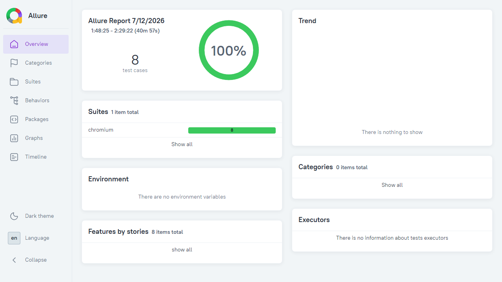
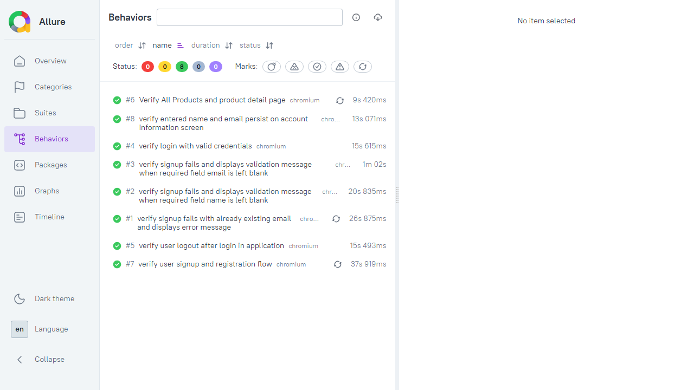
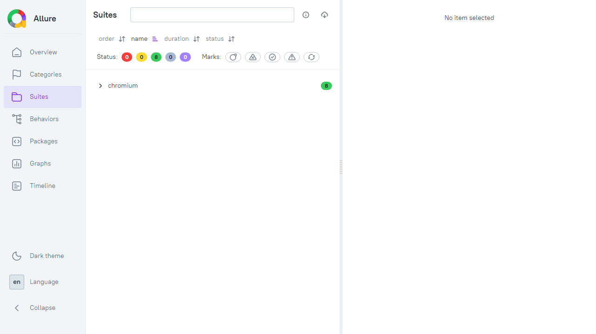

# Automation Exercise – Playwright Framework

End-to-end UI automation framework for [Automation Exercise](https://automationexercise.com/) built with **Playwright**, **TypeScript**, and the **Page Object Model (POM)** pattern.

The framework separates **test logic** (`tests/`) from **reusable application code** (`src/`) so tests stay readable, maintainable, and easy to scale.

---

## Tech Stack

| Tool | Purpose |
|------|---------|
| [Playwright](https://playwright.dev/) | Browser automation and test runner |
| [TypeScript](https://www.typescriptlang.org/) | Type-safe test and framework code |
| [Faker](https://fakerjs.dev/) | Generate random test data (names, emails, etc.) |
| [Allure](https://allurereport.org/) | Rich HTML test reporting |
| [cross-env](https://www.npmjs.com/package/cross-env) | Run tests against different environments (QA / Stage) |

---

## Prerequisites

Before you begin, make sure you have:

- **Node.js** v18 or later ([Download](https://nodejs.org/))
- **npm** (comes with Node.js)
- **Git** (to clone the repository)

> **Allure reports (optional):** To open Allure reports locally, install [Allure Commandline](https://allurereport.org/docs/install/) and ensure `allure` is available on your system PATH.

---

## Installation

### 1. Clone the repository

```bash
git clone https://github.com/qakaransharma/Automation_excercise_playwright.git
cd Automation_excercise_playwright
```

### 2. Install npm dependencies

```bash
npm install
```

This installs Playwright, TypeScript types, Faker, Allure reporters, and other packages defined in `package.json`.

### 3. Install Playwright browsers

```bash
npx playwright install
```

On Linux/CI environments, install system dependencies as well:

```bash
npx playwright install --with-deps
```

### 4. Verify setup

```bash
npm test
```

---

## Framework Structure

```
Automation_excercise_playwright/
├── .github/workflows/       # CI pipeline (GitHub Actions)
├── src/                     # Framework code (reusable across all tests)
│   ├── config/
│   │   ├── constants/       # Framework & reporter settings
│   │   └── environment/     # QA / Stage environment configs
│   ├── fixture/             # Playwright custom fixtures
│   ├── pages/               # Page Object Model classes
│   └── utils/               # Shared helper utilities
├── tests/
│   └── ui/                  # UI test specifications
├── test-data/               # External test data (JSON files)
├── playwright.config.ts     # Playwright global configuration
├── tsconfig.json            # TypeScript compiler options
└── package.json             # Dependencies and npm scripts
```

---

## Why We Use `src/` – Framework Layer

The `src/` folder contains everything that **supports** the tests. Tests should not contain locators, login logic, or environment details — those live here.

### `src/config/environment/`

Manages **multi-environment** support. Switch between QA and Stage using the `ENV` variable.

| File | Purpose |
|------|---------|
| `qa.ts` | QA environment URL, credentials, and user details |
| `stage.ts` | Stage environment URL, credentials, and user details |
| `index.ts` | Exports all environment configs |
| `env.ts` | Reads `process.env.ENV` and returns the active config as `currentEnv` |

**Why?** Keeps credentials and URLs out of test files. Change environment in one place without editing every test.

### `src/config/constants/`

Central place for framework behaviour settings.

| File | Purpose |
|------|---------|
| `frameworkConstants.ts` | Retries, workers, headless mode, slow-mo, screenshot/video/trace settings |
| `reportConstants.ts` | Reporter configuration (HTML + Allure) |

**Why?** One file to control how tests run (parallel or serial, headed or headless, reporting) instead of scattering settings across tests.

### `src/fixture/`

Playwright **custom fixtures** that inject ready-to-use objects into every test.

| File | Purpose |
|------|---------|
| `baseFixture.ts` | Extends Playwright `test` to auto-navigate to `currentEnv.baseUrl` on every test |
| `pagesFixture.ts` | Injects all Page Object instances (`loginPage`, `navbarPage`, `productsPage`, etc.) into tests |

**Why?** Tests receive pre-built page objects automatically — no `new LoginPage(page)` in every test file. Reduces boilerplate and keeps setup consistent.

### `src/pages/`

**Page Object Model (POM)** classes. Each class represents one page or UI section.

| File | Purpose |
|------|---------|
| `login.page.ts` | Login form actions (enter email, password, submit) |
| `sign-in.page.ts` | Signup / registration form actions |
| `navbar.page.ts` | Top navigation bar (click menu items, check visibility) |
| `products.page.ts` | All Products listing page |
| `products.details.page.ts` | Individual product detail page |
| `logout.page.ts` | Login and logout flow |
| `index.ts` | Barrel export — import all pages from one place |

**Why?** If a locator or UI flow changes, update **one page class** instead of every test that uses it.

### `src/utils/`

| File | Purpose |
|------|---------|
| `commonUtils.ts` | Reusable actions: click, fill, wait, navigate, get text, hover |

**Why?** Shared wait/click/fill logic with consistent timeouts lives in one utility class used by all page objects.

---

## Why We Use `tests/` – Test Layer

The `tests/` folder contains **only test scenarios** — what to verify, in what order, and what to assert. Tests import framework code from `src/`.

### `tests/ui/`

| File | What it tests |
|------|---------------|
| `01-sign-in.spec.ts` | Full user signup and account registration flow with random data (Faker + unique email) |
| `02-signup-error.spec.ts` | Negative signup scenarios — duplicate email error messages |
| `03-login.spec.ts` | Login with valid credentials from environment config |
| `04-logout.spec.ts` | Login, verify logout link, perform logout, verify redirect to login page |
| `05-product.spec.ts` | Navigate to Products, open first product, verify product name against `test-data/productDetails.json` |

**Why separate test files?** Each file covers one feature area. Easy to run a single scenario, debug failures, and onboard new team members.

### `test-data/`

| File | Purpose |
|------|---------|
| `productDetails.json` | Expected product name used for assertions in product tests |

**Why external JSON?** Test data can be updated without changing test code — useful for data-driven testing.

---

## Running Tests

### Run all tests

```bash
npm test
```

### Run tests in headed mode (visible browser)

```bash
npm run test:headed
```

### Run tests by environment

```bash
# QA environment (default)
npm run test:qa

# Stage environment
npm run test:stage
```

### Run a single test file

```bash
npx playwright test tests/ui/03-login.spec.ts
```

### Run a specific test by name

```bash
npx playwright test -g "verify login with valid credentials"
```

### Run in debug mode

```bash
npx playwright test --debug
```

---

## npm Scripts Reference

| Script | Command | Description |
|--------|---------|-------------|
| `test` | `npx playwright test` | Run all tests (default: QA env) |
| `test:headed` | `npx playwright test --headed` | Run with browser UI visible |
| `test:qa` | `cross-env ENV=qa npx playwright test` | Run against QA config |
| `test:stage` | `cross-env ENV=stage npx playwright test` | Run against Stage config |
| `report:playwright` | `npx playwright show-report` | Open Playwright HTML report |
| `allure:generate` | `allure generate ...` | Generate Allure report from results |
| `allure:open` | `allure open allure-report` | Open generated Allure report |
| `allure:serve` | `allure serve allure-report` | Serve Allure report locally |
| `clean:allure` | Removes `allure-results` and `allure-report` folders |

---

## Environment Configuration

Set the active environment with the `ENV` variable:

| Value | Config file used | Default |
|-------|------------------|---------|
| `qa` | `src/config/environment/qa.ts` | Yes |
| `stage` | `src/config/environment/stage.ts` | No |

Example — run login test on Stage:

```bash
cross-env ENV=stage npx playwright test tests/ui/03-login.spec.ts
```

Each environment config provides:

- `baseUrl` – application URL
- `emailAddress` / `password` – login credentials
- `testUserFirstName` / `testUserLastName` – user details for signup tests
- `postalCode` – address data for registration

---

## Reports

This framework generates two types of reports:

### Playwright HTML Report

Generated automatically after each run.

```bash
npm run report:playwright
```

Output folder: `playwright-report/`

### Allure Report

```bash
npm run allure:generate
npm run allure:open
```

Output folders: `allure-results/` (raw) and `allure-report/` (generated HTML)

#### 📊 Allure Report Screenshots

**Overview — Summary & Pass Rate**



**Behaviors — All Test Cases with Status & Duration**



**Suites — Test Suite Breakdown**



---

## CI/CD

GitHub Actions workflow (`.github/workflows/playwright.yml`) runs on every push/PR to `main` or `master`:

1. Checks out code
2. Installs dependencies (`npm ci`)
3. Installs Playwright browsers
4. Runs all tests
5. Uploads Playwright HTML report as an artifact (retained 30 days)

---

## Key Configuration Files

| File | Purpose |
|------|---------|
| `playwright.config.ts` | Test directory, timeouts, browser projects, reporters, screenshot/video/trace settings |
| `tsconfig.json` | TypeScript strict mode, CommonJS modules, Node.js types |
| `package.json` | Dependencies, npm scripts, project metadata |
| `.gitignore` | Excludes `node_modules/`, reports, and test artifacts from version control |

---

## Design Principles

1. **Separation of concerns** — `src/` = how to interact with the app; `tests/` = what to verify
2. **Page Object Model** — UI locators and actions live in page classes, not in tests
3. **Fixtures** — Shared setup (navigation, page objects) injected automatically
4. **Environment-driven** — URLs and credentials controlled by `ENV`, not hardcoded in tests
5. **Centralized config** — Framework behaviour (retries, headless, reporters) in one place
6. **External test data** — JSON files for data that may change independently of test logic

---

## Author

**Karan Sharma**

Repository: [Automation_excercise_playwright](https://github.com/qakaransharma/Automation_excercise_playwright)
